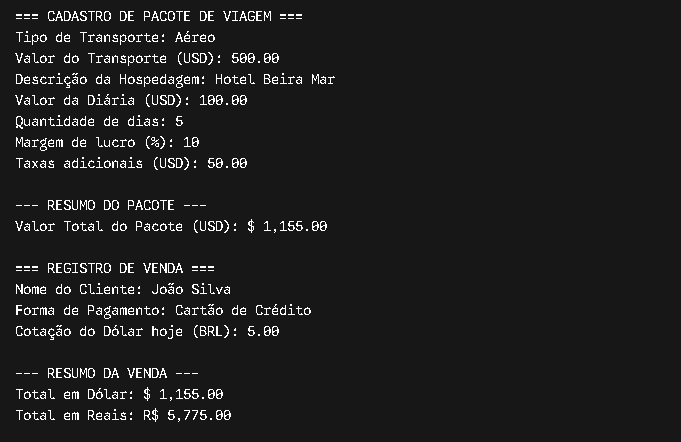

# AgenciaViagens - System Core (Java CLI)

Um sistema em linha de comando (CLI) desenvolvido em Java para simulação de orçamentos, cálculo de pacotes turísticos e processamento de vendas com conversão cambial dinâmica (USD para BRL).

---

## 📐 Arquitetura e Decisões de Projeto

O projeto foi construído utilizando os princípios de **Programação Orientada a Objetos (POO)** e a estrutura padrão do **Apache Maven**, focando em encapsulamento, separação de responsabilidades e reutilização de código.

* **`Transporte`**: Modelo de dados para o modal (aéreo, rodoviário, marítimo) e valor base em dólar.
* **`Hospedagem`**: Gestão de diárias e especificações da acomodação.
* **`PacoteViagem`**: Classe de domínio responsável por consolidar transporte, dias de hospedagem, taxas adicionais e aplicação de margem de lucro.
* **`Venda`**: Regra de negócio financeira, responsável pela associação ao cliente, forma de pagamento e conversão de moeda (USD/BRL).
* **`Main`**: Ponto de entrada da aplicação e interface com o usuário via terminal.

### Estrutura do Projeto

```text
AgenciaViagens/
├── pom.xml
└── src/
    └── main/
        └── java/
            └── agenciaviagens/
                ├── Hospedagem.java
                ├── Main.java
                ├── PacoteViagem.java
                ├── Transporte.java
                └── Venda.java
```

---

## 🛠️ Tecnologias e Pré-requisitos

* **Linguagem:** Java 11 ou superior (JDK)
* **Build System:** Apache Maven 3.x
* **Paradigma:** Programação Orientada a Objetos (POO)

---

## 🚀 Como Compilar e Executar

### 1. Clonar o Repositório
```bash
git clone https://github.com/Ravz7/agencia-de-viagem.git
cd agencia-de-viagem
```

### 2. Compilar com Maven
```bash
mvn clean package
```

### 3. Executar o JAR Gerado
```bash
java -jar target/AgenciaViagens-1.0-SNAPSHOT.jar
```

*(Ou execute diretamente a classe `agenciaviagens.Main` dentro de sua IDE de preferência).*

---

## 📸 Demonstração Visual



---

## 👤 Autor

Desenvolvido por **Eduardo Amaral**  
[GitHub Profile](https://github.com/Ravz7) | [LinkedIn](https://www.linkedin.com/in/eduardo-amaral-de-morais-2785a53a0/)
